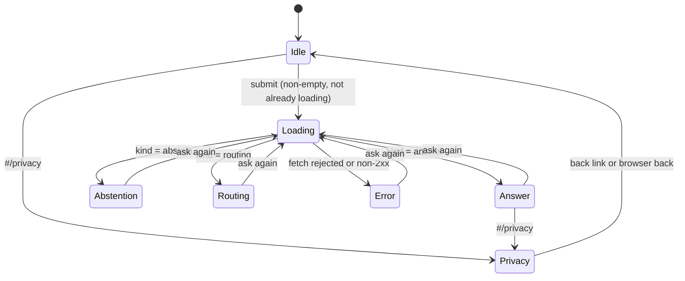

# App Flow — Finance Answer Engine

**Date:** 2026-08-03 (retrospective, derived from `web/src/`) · **PRD:** [PRD.md](PRD.md)

The interactive surface is two hash routes and one form. That is the whole
application, and the flow document is short because the product is. What is
worth documenting is not the navigation — it is that **three of the four
terminal states are non-answers**, and each has to be as legible as an answer.

## Entry points

- `http://localhost:5173/` — the ask page. There is no deep link to a result:
  answers are not addressable, because nothing is stored.
- `#/privacy` — the privacy notice. A real, bookmarkable, back-button-friendly
  hash route wired by hand in `App.tsx` rather than a modal, and rather than a
  router dependency for one extra page. Reached from the link inside the
  disclaimer banner.

There is no email, notification or invitation path. There are no accounts, so
there is no sign-in, no invite and no expiry.

## The happy path

1. **Land.** The masthead, a persistent guidance-not-advice banner (present
   before any question is asked, not revealed with the first result), the input,
   and the OGL attribution footer.
2. **Type a question** (500-character cap, enforced by `maxLength` in the browser
   and again by the API schema).
3. **Submit.** A skeleton appears inside an `aria-live="polite"` region with
   `role="status"`; the button label becomes "Checking…".
4. **One of three outcomes arrives**, all rendered into the same live region:
   - **Answer** — the claim ledger. Each row is one verbatim sentence with its
     receipt underneath: organisation badge, linked source title, "updated"
     date where the source declares one, "checked" fetch date, a confidence
     chip, a grounding chip, and a freshness chip when the claim is not current.
     Above the rows: "N of N statements grounded in their cited source".
   - **Abstention** — the refusal card, stamped *Not answered — cannot verify*,
     with the engine's specific explanation, chips naming the concepts no
     trusted source covers, meters showing each answerability signal against its
     threshold, and links to MoneyHelper and the FCA Register.
   - **Routing** — the same card stamped *Not answered — needs an adviser*, with
     the explanation of why regulated advice carries protections guidance cannot
     (FOS, FSCS, an accountable adviser).
5. **Ask again.** The form is not cleared; the previous result is replaced.

## Every state of every screen

| Screen | Loading | Empty | Populated | Error | Unauthorised | Offline / slow |
|---|---|---|---|---|---|---|
| **Ask page** | Three-row skeleton in an `aria-live` region, `role="status"`, label "Checking sources"; submit shows "Checking…" and re-entry is guarded | First run: banner + form + footer, with a worked placeholder ("e.g. How does a Lifetime ISA work?"). No result area at all — no empty box pretending to be a result | Answer ledger, abstention card, or routing card | `role="alert"`: the thrown message plus "Check the engine is running, then try again." | **Does not exist** — no auth, no roles, nothing to be unauthorised for | The skeleton persists; there is no timeout and no cancel. A slow response looks identical to a working one |
| **Privacy notice** | n/a — static component, no fetch | n/a | Always fully populated | n/a | **Does not exist** | n/a |

**Empty.** The first-run state is the form itself. Nothing renders a result
container until there is a result, so there is no blank panel to misread as a
failure.

**Error.** One case: the `fetch` to `/api/ask` rejected or returned non-`ok`.
The message names the likely cause rather than saying "something went wrong",
which matters here because the overwhelmingly likely cause in a local build is
that the Python server is not running — a condition the user can actually fix.
Never a stack trace; the server's own contract is a generic message out, detail
to the log.

**Unauthorised.** Listed as not-applicable rather than filled in. There are no
accounts, sessions or roles, so there is no state where a user is signed out,
holds the wrong role, or has had access revoked while looking at a page. If this
ever gained a multi-user surface, this row is the first thing that would have to
be designed, and the PRD says so.

**Offline / slow.** The honest gap. There is no request timeout, no cancel and
no "this is taking a while" escalation, so a hung server shows an indefinite
skeleton. Acceptable for a local single-operator build where the engine answers
in milliseconds (pure-Python BM25 over an in-memory snapshot, no network call at
query time), and the first thing to fix before anything is deployed.

## Transitions

The three non-answer terminals are ordinary states, not error branches. That is
the product thesis expressed in the state machine: an abstention is a result.

## Permissions per state

Every state is reachable by anyone who can load the page. There is nothing to
gate and nothing that changes when access is revoked, because there is no access
to revoke. The one thing that *is* scoped is data retention rather than
visibility: the question text a user typed is deleted from the local log 30 days
later, whether or not anyone asks.

## Dead ends

None. Every terminal state carries a forward path:

- an abstention and a routing event both carry three official links out
  (MoneyHelper guidance, MoneyHelper's adviser-choosing guide, the FCA Register)
  — the refusal is not the end of the user's task, only of this tool's part in it;
- the error state names a fixable cause and the form stays live;
- the privacy notice carries a back link *and* works with browser back, because
  it is a real route.

One near-miss worth naming: the diagnostics panel on a refusal renders nothing
at all when there are no uncovered terms and no signals — a stopword-only query
is the case — rather than an empty bordered container with stray margin. An
empty box that looks like a broken box is its own defect.

## Accessibility

Gated by `jest-axe` in the web suite, not left to inspection. 17 vitest cases,
including axe assertions on the idle state, the answer state, the loading state
and the privacy notice.

- **Keyboard path**: input → submit → (results are static content) → footer
  links → privacy link. Standard tab order; no traps, no custom widgets, no
  `outline: none` anywhere in the stylesheet.
- **The submit button uses `aria-disabled`, not `disabled`.** A truly disabled
  button drops out of the tab order and announces nothing, so a keyboard user
  who reaches an empty form gets silence. The guard is in the submit handler
  instead, which is where a correctness guard belongs anyway.
- **Screen reader announcements**: the results container is `aria-live="polite"`,
  so each outcome is announced when it arrives; the skeleton is `role="status"`
  with the label "Checking sources"; the error is `role="alert"`; each card
  carries an `aria-label` naming its outcome ("Answer", "Not answered — cannot
  verify", "Not answered — needs an adviser"); the uncovered-term and signal
  lists carry their own labels.
- **Colour is never the only signal.** Confidence, grounding and freshness are
  all rendered as chips with words in them; the signal meters spell out
  "0.42 / 0.6 needed" alongside a ✓/✗ glyph, and the numeric value is clamped so
  it can never contradict the glyph (a raw 0.599 would otherwise render as
  "0.6 / 0.6 needed" beside a cross).

## Non-interactive flows

Four operator CLIs sit beside the web app. They are not user interfaces and get
no screens, but each is a flow with failure states worth stating:

| Command | Flow | Fails how |
|---|---|---|
| `corpus.refresh` | Fetch every manifest entry, report per-entry ok/FAIL, write the snapshot | Individual failures are listed and skipped; nothing is written if every entry failed |
| `eval` | Replay 21 golden questions, print the honesty report | Exits non-zero on FAIL; missing snapshot names the refresh command |
| `bench` | Validate 131 labels against the corpus, then score the gate | **Refuses to score** against labels known to be broken |
| `gaps` | Replay the ask log, rank concepts no source covers | Missing log exits 2; a log with lines but no usable question is refused outright rather than reported as clean |
